# Integrated Disease Surveillance aggregate system design { #ids-agg-design }

## Introduction

This document describes the system design for the aggregate disease surveillance digital data package. This includes the following:

1. Disease Covered in the Package
2. Data Sets
3. Data Exchange Mechanisms
4. Dashboards
5. Validation Rules
6. Validation Notifications
7. Predictors

The aggregate surveillance package meta-data is provided in several different configurations to show countries possibilities for configuration in their own context. This also allows countries to select the configuration options that are most relevant to their context.

## Diseases Covered

The diseases covered in this package are as follows:

|||||
| ----------------------- | ----------------------- | ------------ | ------------ |
| Acute Flaccid Paralysis | Acute Watery Diarrhoea  | Cholera      | Dengue Fever |
| Diarrhoea with Blood (Shigella)    | Diptheria               | Measles      | Meningitis   |
| Neonatal Tetanus        | Non Neonatal Tetanus    | Pertussis    | Rabies       |
| Rubella                 | Viral Hemorrhagic Fever | Yellow Fever |              |

Note that you are able to add a disease to the design as needed.

## Data Set Overview

The surveillance configuration package for aggregate reporting contains 4 datasets described below.

| **Name**                                                     | **Periodicity** | **Purpose**                                                  |
| ------------------------------------------------------------ | --------------- | ------------------------------------------------------------ |
| IDS - Report: Suspected, Confirmed, Death                   | Weekly          | Reporting of surveillance activities: suspected cases, confirmed cases and deaths. Suspected cases and deaths are disaggregated, confirmed case data is not disaggregated. |
| IDS - Report: Suspected, Death                              | Weekly          | Reporting of surveillance activities: suspected cases and deaths. This data is disaggregated. |
| IDS - Aggregate Lab Weekly Report                           | Weekly          | Reporting of confirmed cases directly from labs. This data is not disaggregated. |
| Population Weekly                                            | Weekly          | Weekly population data used for alerts. It is weekly as the DHIS2 predictor function is used to generate thresholds and currently can not combine data of different periodicity (in this case, weekly surveillance data with annual population data). |

### IDS - Report: Suspected, Confirmed, Death

The **IDS - Report: Suspected, Confirmed, Death** dataset contains information on suspected cases, confirmed cases and deaths on the diseases outlined in the section [diseases covered](#diseases-covered). A number of the diseases have **disaggregated** suspected cases and deaths and the form and uses a **custom form design**. The custom form design is a result of combining disaggregated and non-disaggregated data elements that belong to the same disease and are required to be grouped together.

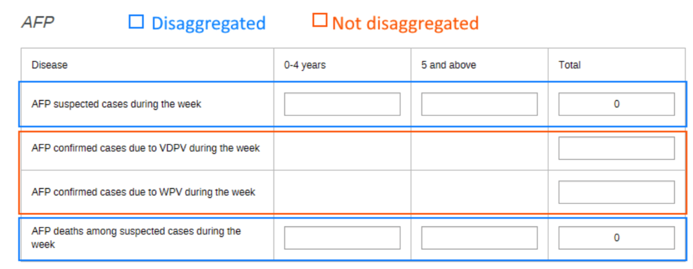

Disaggregations have been applied using the category model within DHIS2. This model has 2 key advantages when using disaggregations:

- It reduces the number of unique data elements that need to be made.
- In analysis, this allows for quick addition of the age breakdowns that can pivot as required. We can also see that the totals are quite useful to determine the total number related to a particular variable or period.

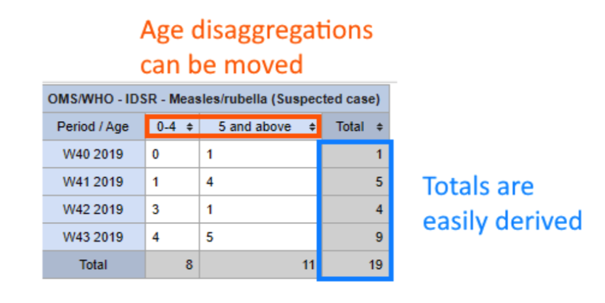

If you need to modify this dataset so it is not disaggregated by age, you can do so directly before or after installation. It would be the recommended approach to do this before installation by following steps within the installation guide on modifying the package.

This dataset assumes a mature configuration in which suspected cases, confirmed cases and deaths are all being collected. It also assumes that everyone interacting with this dataset should have access to edit this information (ie. enter data and modify existing data values). This may not be the case in all implementantions, if, for example, you would like to segment off who can edit data on suspected and confirmed cases.

In summary, if it is the case where you are ***not yet collecting data*** on confirmed cases or ***you want seperate groups to have the ability to edit*** suspected and confirmed case data, then this may not be the dataset to implement in your context. If ***you are collecting data*** on confirmed cases, and you want ***equal access for all users to edit*** the suspected and confirmed case data, then this type of dataset design would be suitable to implement in your own context.

### IDS - Report: Suspected, Death

The **IDS - Report: Suspected, Death** dataset contains information on suspected cases and deaths on the diseases outlined in the section [diseases covered](#diseases-covered). Note that it does not contain information on confirmed cases. This was done in the event that lab confirmation was a separate process, or that seperate access needs to be provided for those entering confirmed case data. This dataset therefore links to the IDS - Aggregate Lab Weekly Report in the event that cases are confirmed using a separate process. This form uses the same data elements and structure contained in the IDS - Aggregate Weekly Report dataset for cases and deaths. The custom form design from this dataset was therefore re-used such that a uniform design would be applied between this dataset and the IDS - Aggregate Lab Weekly Report dataset.

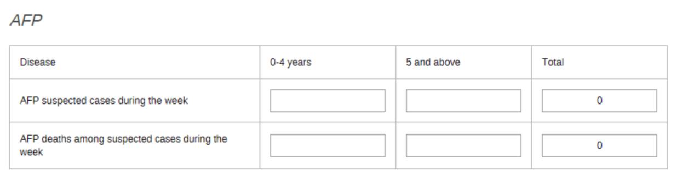

This dataset is meant for settings where either

1. Data on confirmed cases is not yet being collected through DHIS2
2. Data on confirmed cases is being collected, but is either a seperate process or access to edit this data needs to be seperated

### IDS - Aggregate Lab Weekly Report

The IDS Aggregate Lab Weekly report contains information on confirmed cases for the diseases outlined in [Table 1](#table-1). Note that it **does not contain information on suspected cases and deaths**. This report is meant to complement the **IDS - Report: Suspected, Confirmed, Death** dataset when the lab confirmed cases reporting process is separate from the reporting of suspected cases and deaths. This includes scenarios in which you want different users to have the ability to edit confirmed case data when compared to suspected cases/death data.

Like the data sets `IDS - Report: Suspected, Confirmed, Death` and `IDS - Report: Suspected, Death` this dataset uses a custom form design to remain consistent in its appearance.

### Population Weekly

The Population weekly dataset is used to collect weekly population data. The main function of this is for thresholds for ***meningitis***. It is a weekly data set as the DHIS2 predictor function is used to generate thresholds and currently can not combine data of different periodicity (in this case, weekly surveillance data with annual population data). The data element that it contains, population weekly, uses the aggregation type of "last value" and is meant to be equal to the estimated population total for a year within a given geographical region.

As an example application of this, if your yearly population within District A is 1000, then the weekly population within District A would also be 1000. By using the "last value" aggregation type, these weekly values will not sum and will consistently be equal to 1000 throughout the year within this district.

## Data Exchange Mechanisms

There are two data exchange mechanisms that are available in addition to using the DHIS2 API directly:

1. For countries that are using DHIS2, an app for data exchange has been made to push data directly from their DHIS2 system to other DHIS2 systems
2. For countries that are not using DHIS2, an app for accepting data in Excel format has been made

### DHIS2 to DHIS2 data exchange

As part of this package, an app called `dhis2 transfer` has been developed in order to push data from one DHIS2 system to another. Once this app is configured, it allows for one DHIS2 system to send its data to another DHIS2 system (for example, a regional system collecting data from several countries). The initial configuration only needs to occur once, and can be done completely through the available user interface. Configuration needs to occur for two separate elements:

1. The actual data being sent (ie. the variables/data items)
2. The location of the data being sent (ie. in DHIS2 the organization units)

This matching is necessary as the two systems exchanging data may not exactly be aligned in terms of the names, codes or IDs it uses to identify these different objects that are being synchronized across the two systems. The app currently sends aggregate data via aggregate indicators from the source system to data elements within the destination system, so relevant indicators will need to be available from within the source system (ie. the system sending the data)

An example of matching variables is shown below:

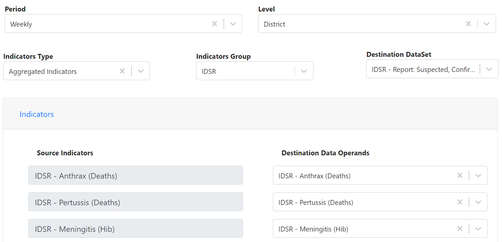

Once this configuration is saved you can call on it as needed, select the period you want to send data for and send the data.

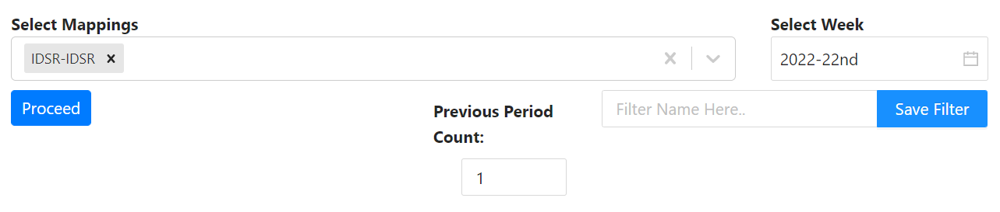

> **NOTE**
>
>This process can also be scheduled if you want to send the data automatically

For more information on the data transfer app, please refer to the app's manual.

### Excel to DHIS2 data exchange

As part of this package an app called "data import wizard" has been made available in order for a DHIS2 system to receive Excel data. This tool also needs to be configured once with the mapping matching the information in the Excel sheet to the information available in DHIS2. Note that this app can be used beyond surveillance use cases as well.  

You can preview the data that is being brought into the system to verify the mapping from the Excel file is correct as shown below.

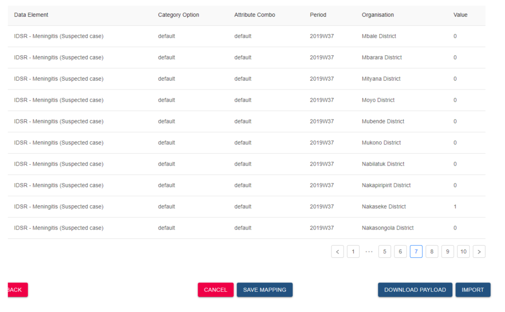

Once the data has been reviewed and verified from the Excel sheet, it can be imported directly into the DHIS2 system.

For more information on the data import wizard app, please refer to the app's manual.

## Dashboards

Dashboards for each of the diseases listed within the [diseases covered](#diseases-covered) section are available. Each disease specific dashboard follows the same layout:

1. Pivot table showing suspected outbreak areas in the last 12 weeks
2. Map showing suspected outbreak areas in the last week
3. Pivot table showing suspected outbreak areas in the last 12 weeks
4. Map showing confirmed outbreak areas in the last week
   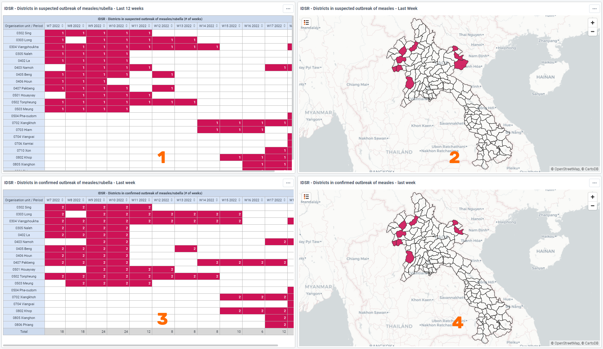
5. Pivot table showing the total weeks an area has been in suspected outbreak in the last year
6. Map showing suspected outbreak areas in the last year
7. Pivot table showing the total weeks an areas has been in confirmed outbreak in the last year
8. Map showing confirmed outbreak areas in the last year
   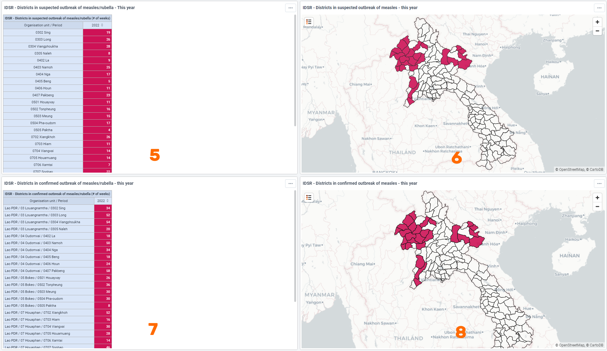
9. Map showing the incidence rate in the last week
10. Map showing the distribution of cases in the last week
11. Chart showing the number of suspected cases and deaths in the last 12 weeks
12. Pivot table showing the number of suspected cases and deaths in the last 12 weeks
   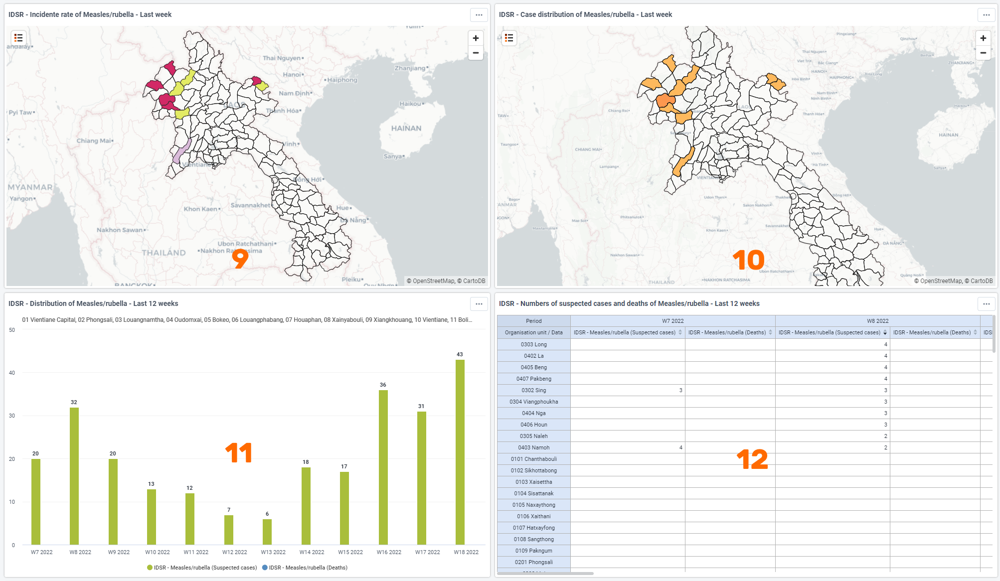
13. Chart showing a comparison of cases by weeks of this year and last year
   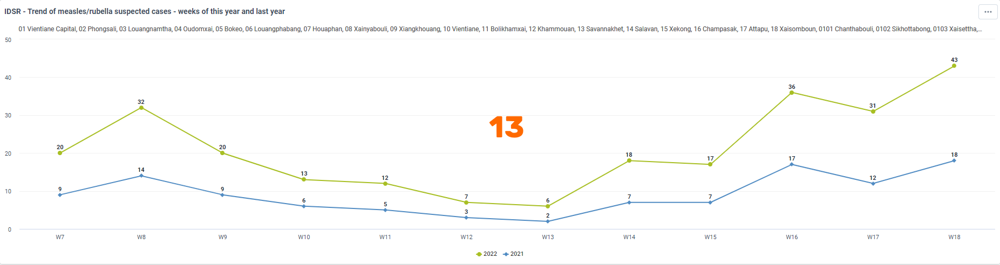

## Validation Rules

Validation rules have been implemented, including both logical checks of consistency as well to detect susepcted and confirmed outbreaks based on various criteria.

### Validation Rules - Consistency Checks

Validation rules that perform consistency checks are comparing weekly confirmed cases with weekly suspected cases. The assumption is that confirmed cases should be less than or equal to suspected cases within a given week for all diseases listed in the [diseases covered](#diseases-covered) section. For a full list of these validation rules, please refer to the metadata reference file. If this assumption is not correct within your implementation, you will want to modify these as they will appear during data entry whenever a user completes a data set and a violation is detected as we can see in the example below.

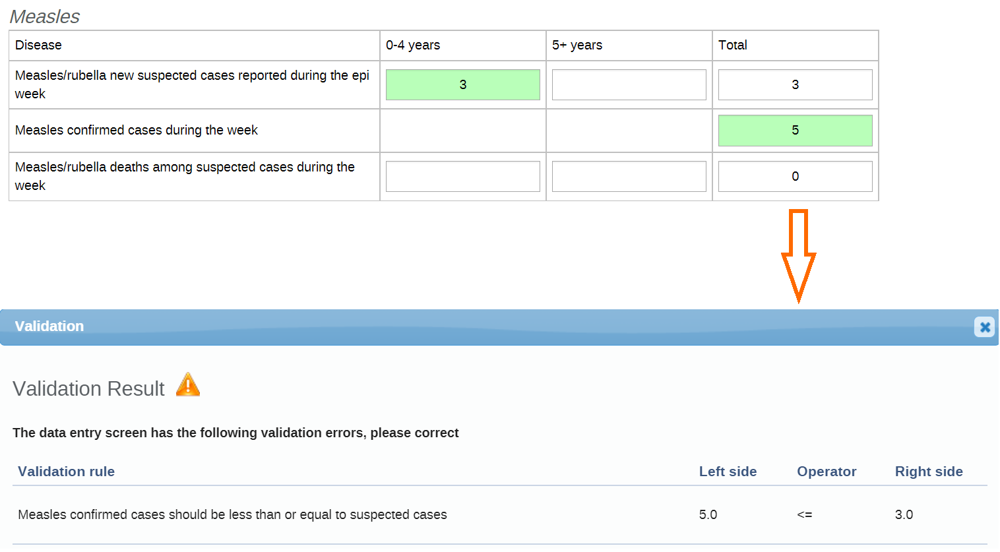

### Validation Rules - Thresholds

Validation rules are also used to determine if a threshold has been surpassed. These validation rules are sometimes using the output of a predictor to make a comparison depending on the criteria that needs to be met. When these rules are violated, a notification is sent out.

The following validation rules are triggered and send a notification based on the criteria specified below:

| Name                                                         | Description/Notification Trigger                             |Predictor Used|
| ------------------------------------------------------------ | ------------------------------------------------------------ |-----------|
| Suspected Non Neonatal Tetanus                               | 1 suspected case                                             |No |
| Probable Yellow Fever                                        | 1 case with IgM positive                                     |No |
| Confirmed Rubella                                            | 1 confirmed case                                             |No |
| Cholera RDT positive                                         | 1 case RDT positive                                          |No |
| Suspected Plague                                             | 1 suspected case                                             |No |
| Confirmed Rabies                                             | 1 confirmed case                                             |No |
| Suspected Measles/Rubella                                    | 5 suspected cases in one district in 30 days                 |Yes    `IDS - Measles Suspected Outbreak` |
| Confirmed Anthrax                                            | 1 confirmed case                                             |No |
| Confirmed Dengue Fever                                       | 1 confirmed case                                             |No |
| Suspected Pertussis                                          | 1 suspected case                                             |No |
| Confirmed Measles outbreak                                   | 3 confirmed cases in one district in 30 days                 |Yes   `IDS - Measles Confirmed Outbreak`|
| Two or more Acute Watery Diarrhea (AWD) aged 2 years and older (linked by time and place) with severe dehydration or dying | 2 or more AWD aged 2 years + (linked by time and place) with severe dehydration or dying | No |
| Suspected Neonatal Tetanus                                   | 1 suspected case                                            | No |
| Meningitis alert                                             | 3 suspected cases/100 000 inhabitants / week (Minimum of 2 cases in one week) for district /subdistrict population above 30000 | Yes   `IDS - Meningitis alert` |
| Suspected Viral Hemorrhagic Fever                            | 1 suspected case                                             | No |
| Acute Watery Diarrhea Death                                  | One death from severe acute watery diarrhoea in a person at least 5 years old | No|
| Meningitis outbreak                                          | 10 suspected cases/100 000 inhabitants / week for district /subdistrict population above 30000   **OR**   5 suspected cases in one week   **OR**   doubling of the number of cases in a three-week period (epidemic alert) for district/ subdistrict population under 30000 | Yes   `IDS - Meningitis outbreak` |
| One death from severe AWD in a person of any age             | 1 death from severe AWD in a person of any age               | No |
| Confirmed AFP (VDPV)                                         | 1 confirmed case                                             |No |
| Suspected Diptheria                                          | 1 suspected case                                             |No |
| Confirmed AFP (WPV)                                          | 1 confirmed case                                             |No |
| Suspected Diarrhea with Blood (Shigella)                     | 1 suspected case                                             |No |

Note the differentiation between `suspected cases` and `confirmed cases`. In the context of this surveillance package, suspected cases identify if an area is in alert while confirmed case identify if an area is in outbreak.

These rules can be set to run automatically or can also be run manually. Configuration of the automated process is discussed within the installation guide.

## Validation Notifications

In response to a threshold being surpassed, notifications can be sent out using any combination of 3 methods:

- The internal messaging service within DHIS2
- SMS
- E-mail

For more information on setting these services up, refer to the documentation on [email](https://docs.dhis2.org/en/use/user-guides/dhis-core-version-master/configuring-the-system/system-settings.html#system_email_settings) and [SMS](https://docs.dhis2.org/en/use/user-guides/dhis-core-version-master/maintaining-the-system/configure-sms.html).

An example e-mail that is sent when a measles outbreak is detected can be seen below.

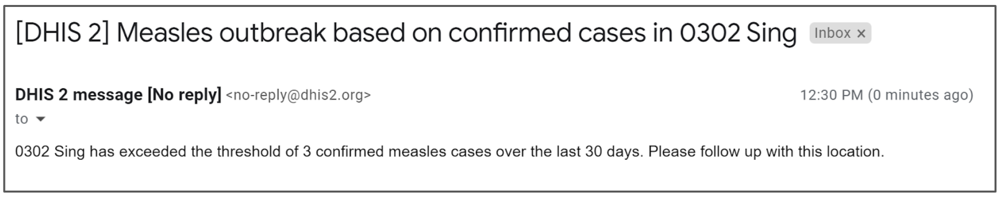

For a full list of validation notifications, consult the metadata reference file. Validation notifications are available for each disease based on the criteria defined in the [validation rules thresholds](#validation-rules---thresholds) section.

These can be sent out in response to either a manual or automated process of checking your data. Configuration of the automated process is discussed within the installation guide.

## Predictors

For more information on configuring predictors, please consult [the documentation](https://docs.dhis2.org/en/use/user-guides/dhis-core-version-master/configuring-the-system/metadata.html#about-predictors).

### Areas in outbreak

Outside of predictors being used within validation rules, they are also used to visualize areas that are in outbreak. We can see examples of this in visualizations 1-8 within the [dashboards](#dashboards) section. While validation rules can be used to trigger validation notifications, the result of these rules is not stored in a data element and thus can not be used for visualization purposes. A full list of predictors can be found in the metadata reference file. Each disease has predictors that are labelled as either an "alert" -- used in situations where suspected cases are being checked; or an "outbreak" -- used in situations where confirmed cases are being checked.

Predictors are defined to store values within companion data elements that can then be used to create visualizations to identify areas in alert or outbreak. The predictors are defined to identify alerts and outbreaks based on the [validation rules thresholds](#validation-rules---thresholds) section. Let us take two predictors and break them down into its component parts, as each predictor for each disease will need to be understood to be correctly used or altered if needed.

#### Example 1: A disease where 1 suspected case is the threshold (ie. diptheria)

Let us take an example in which 1 suspected case is the threshold to identify if an area is in alert. Note that this same nomenclature would apply to an example in which 1 confirmed case is the threshold to identify if an area is in outbreak.

We can use the example for `diptheria`; if we review the [validation rules thresholds](#validation-rules---thresholds) section we will see one suspected case of diptheria is our threshold.

Within the predictor, we have the following fields:

1. The name of the predictor
2. The description of the predictor
3. The output data element - this is where the result of the predictor is stored
4. The period in which the predictor is running
5. The output organisation unit level of the predictor value

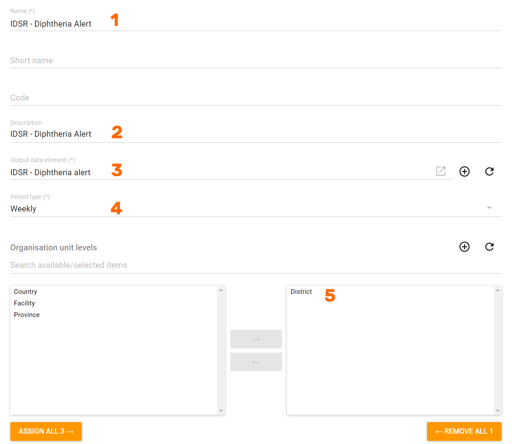

After this is defined we have what is referred to as the `generator`. The generator is essentially the formula used to define the predictor. In this case, using diptheria as our example, we have a logical test stating the following

If the number of suspected diptheria cases is >= 1 within a given org unit, return a value of 1. If this is not the case return a value of 0.

These types of logical if statements are used in all of the predictors within this package. If you are not familiar with boolean logic, a broad overview can be found [here](https://www.lotame.com/what-is-boolean-logic/#:~:text=Boolean%20Logic%20is%20a%20form,are%20either%20true%20or%20false.).

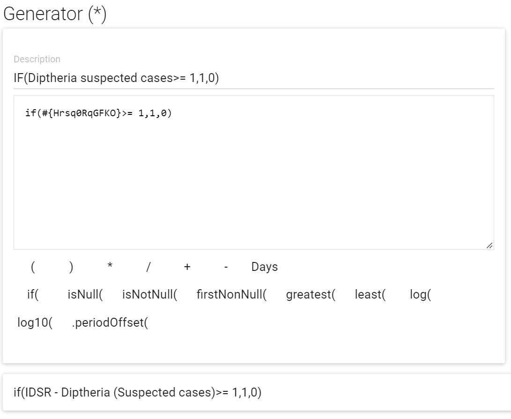

The last components of the predictor identify which period we will be getting data from to use within our generator. We have defined both the sequential sample count and annual sample count as 0. This means that the generator will only be obtaining data from the same week in which the threshold is being checked.

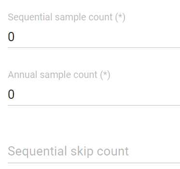

#### Example 2: A disease where a specific threshold formula is used (ie. measles)

In example 2, we can review the threshold for a ***confirmed measles outbreak***. This threshold is defined as `3 confirmed cases in one district in 30 days`. There are some key components that must be considered

1. A total of 3 cases within the district
2. These cases can occur over a period of 30 days

We still have the same fields as in example 1 to start our predictor

1. The name of the predictor
2. The description of the predictor
3. The output data element - this is where the result of the predictor is stored
4. The period in which the predictor is running
5. The output organisation unit level of the predictor value

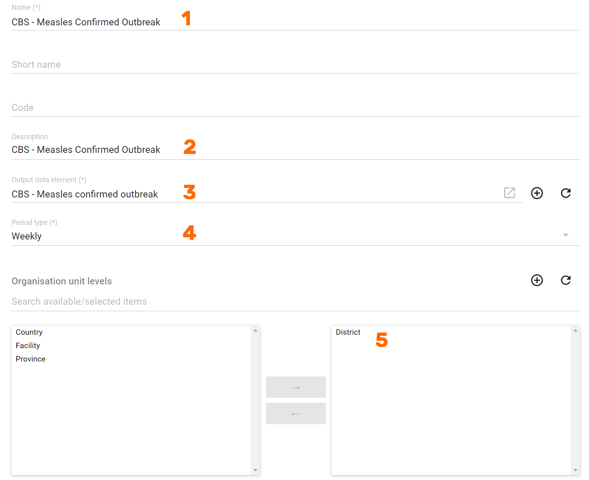

After this is defined we have what is referred to as the `generator`. The generator is essentially the formula used to define the predictor. In this case, using measles as our example, we have a logical test stating the following

>If the sum of confirmed measles cases is greater then 3, return a value of 1. If this is not the case return a value of 0.

Note that this sum is being taken from the level in which there is data, which in this example would be our facilities. Using the generator alone, we have also not met our second criteria which should examine this over a 30 day period.

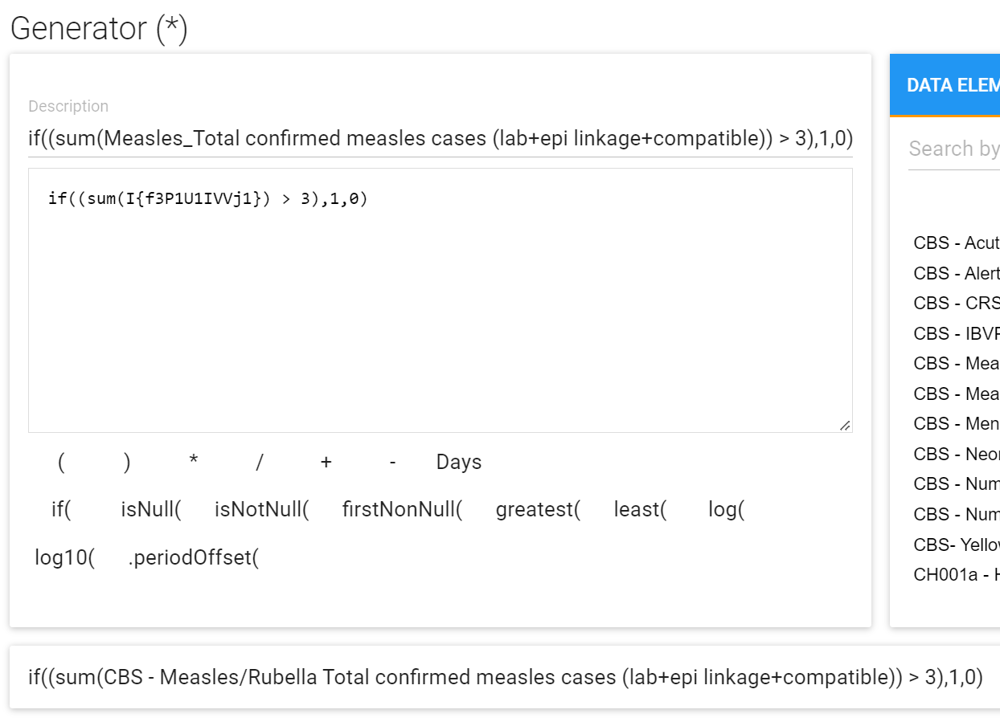

The last components of the predictor identifies which period we will be getting data from to use within our generator. We have defined  the sequential sample count as 4 and the annual sample count as 0. This means that the generator will be obtaining data from the last 4 weeks (since the predictor period is set to weekly), including the current week, for the current year in which the threshold is being checked. This is to meet the criteria of our 30 day period as defined in our threshold.

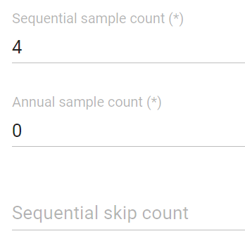

### Predictor Summary

**NB**: We use predictors to help us test our thresholds and store data values to identify areas in alert or outbreak. Areas in alert are based off thresholds using suspected cases, while areas in outbreak refer to thresholds using confirmed cases. To define these thresholds using a predictor we must consider

1. The data element you will output the predictor value to
2. The period in which the predictor will check data against
3. The organisation unit level you will output the predictor value to
4. The generator formula, which will test our data against a defined threshold
5. The sequential and annual sample counts, which will define which periods the predictor is obtaining data from

Altering these components will allow you to alter the definition of the threshold.

These predictors can be set to run automatically or can also be run manually. Configuration of the automated process is discussed within the installation guide.
